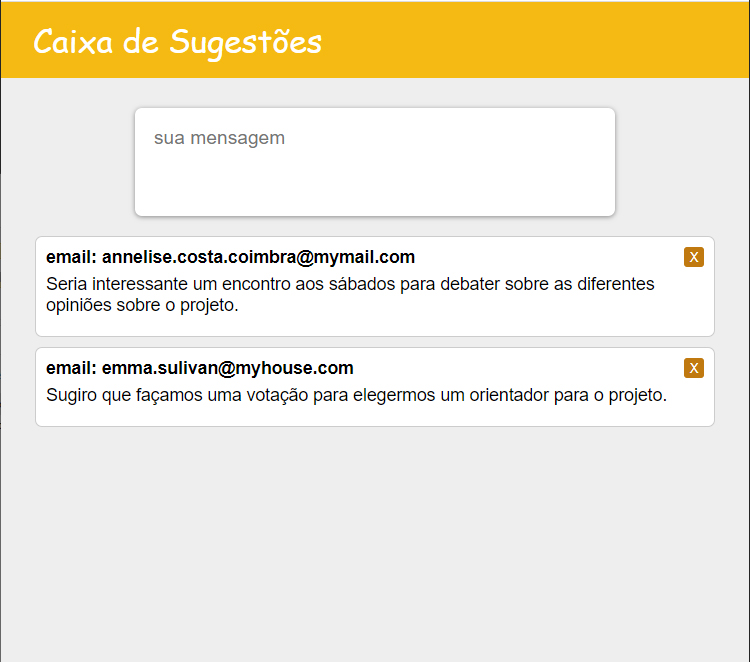

# React JS: Consumindo uma API Node.js
&nbsp;

### Passos iniciais para construção da aplicação.
&nbsp;
>### crie a aplicação react js
```js
> npx create-react-app sugestao
```
&nbsp;

>### Crie as pastas e arquivos
```js
> cd sugestao               // entra na pasta do projeto

> md src\components
> md src\css

echo . > src\components\App.jsx
echo . > src\components\Sugestao.jsx
echo . > src\components\List.jsx
echo . > src\components\Header.jsx
echo . > src\css\index.css
```
&nbsp;

>### instale o axios
```js
> npm install axios
```
&nbsp;

>### instale Material UI Icons
```js
> npm install @material-ui/icons
```
&nbsp;

>### package.json: insira a linha do proxy
>#### _http://localhost:8000/message/_ pode ser apenas _/message/_
```js
{
  // other lines
  
  "name": "sugestao",
  "version": "0.1.0",
  "private": true,
  "proxy": "http://localhost:8000",

  // other lines
}
```
&nbsp;

### No mais, insira os códigos nos devidos arquivos com base neste repositório.
&nbsp;

>### Para rodar a aplicação
```js
> npm start
```
&nbsp;
